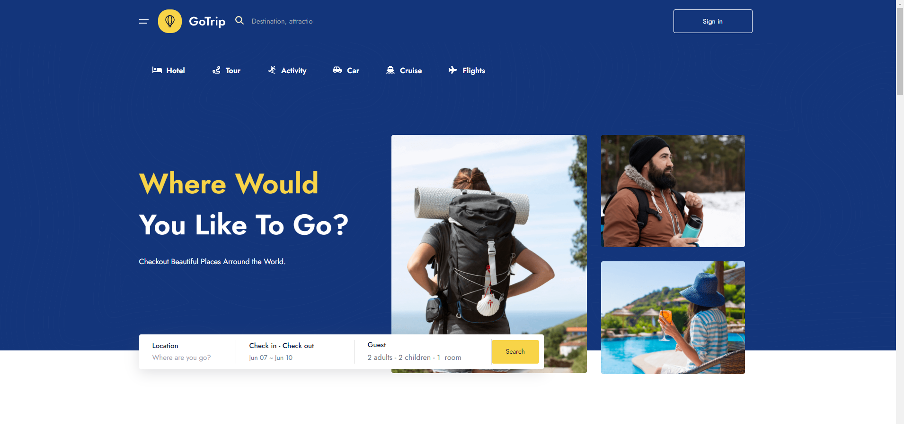

# Hotel Booking App - GoTrip Booking

This Project goes over all of the fundamentals of React includig:

<em>It uses a mock REST api with json-server.</em>
<ul>
<li>Components</li>
<li>JSX</li>
<li>Props</li>
<li>Styling</li>
<li>Handling Events</li>
<li>List & keys</li>
<li>Forms</li>
<li>Context Api</li>
<li>Custom Hooks</li>
<li>HTTP Request</li>
</ul>

## Usage

In the project directory, you can run:

### `npm run start`

Runs the app in the development mode.\
Open [http://localhost:3000](http://localhost:3000) to view it in your browser.

### `npm run server`

Runs the app in the development mode.\
Open [http://localhost:8000](http://localhost:8000) to view it in your browser.
