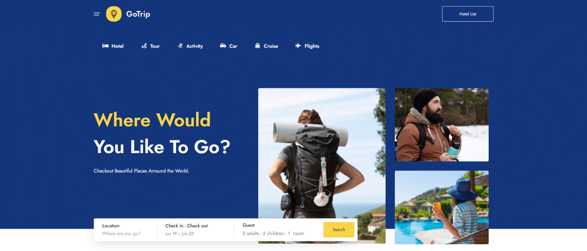
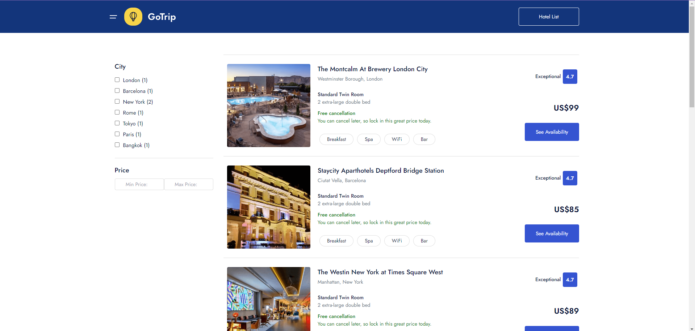

# Hotel Booking App 

This project is a comprehensive demonstration of React fundamentals, including the usage of a mock REST API with <code>json-server</code>.

<h2>Table of Contents</h2>
<ul>
  <li><a href="#features">Features</a></li>
  <li><a href="#installation">Installation</a></li>
  <li><a href="#usage">Usage</a></li>
  <li><a href="#project-structure">Project Structure</a></li>
  <li><a href="#components">Components</a></li>
  <li><a href="#styling">Styling</a></li>
  <li><a href="#context-api">Context API</a></li>
  <li><a href="#custom-hooks">Custom Hooks</a></li>
  <li><a href="#http-requests">HTTP Requests</a></li>
  <li><a href="#contributing">Contributing</a></li>
  <li><a href="#license">License</a></li>
</ul>

<h2 id="features">Features</h2>
<ul>
  <li><strong>Components:</strong> Modular and reusable React components.</li>
  <li><strong>JSX:</strong> Syntax extension for JavaScript used to describe the UI.</li>
  <li><strong>Props:</strong> Passing data to components.</li>
  <li><strong>Styling:</strong> CSS and Sass for component styling.</li>
  <li><strong>Handling Events:</strong> Managing user interactions.</li>
  <li><strong>List &amp; Keys:</strong> Efficiently rendering lists.</li>
  <li><strong>Forms:</strong> Handling user input.</li>
  <li><strong>Context API:</strong> State management with context.</li>
  <li><strong>Custom Hooks:</strong> Reusable hooks for common functionality.</li>
  <li><strong>HTTP Requests:</strong> Fetching data from a mock REST API using <code>axios</code>.</li>
</ul>

<h2 id="installation">Installation</h2>
<ol>
  <li>
    
<strong>Clone the repository</strong>

    <pre><code>git clone https://github.com/your-username/booking-app.git
cd booking-app
</code></pre>
  </li>
  <li>
    
<strong>Install dependencies</strong>

    <pre><code>npm install
</code></pre>
  </li>
  <li>
    
<strong>Set up json-server</strong>

    
Create a <code>db.json</code> file in the root directory with the following content:

    <pre><code>{
  "categories": [
    { "id": 1, "name": "Hotel" },
    { "id": 2, "name": "Tour" },
    { "id": 3, "name": "Activity" },
    { "id": 4, "name": "Car" },
    { "id": 5, "name": "Cruise" },
    { "id": 6, "name": "Flights" }
  ],
  "benefits": [
    { "id": 1, "image": "1.svg", "name": "Best Price Guarantee", "text": "Lorem ipsum dolor sit amet, consectetur adipiscing elit." },
    { "id": 2, "image": "2.svg", "name": "Easy & Quick Booking", "text": "Lorem ipsum dolor sit amet, consectetur adipiscing elit." },
    { "id": 3, "image": "3.svg", "name": "Customer Care 24/7", "text": "Lorem ipsum dolor sit amet, consectetur adipiscing elit." }
  ],
  "countries": [
    { "id": 1, "image": "country-1.png", "name": "United Kingdom" },
    { "id": 2, "image": "country-2.png", "name": "Italy" },
    { "id": 3, "image": "country-3.png", "name": "France" },
    { "id": 4, "image": "country-4.png", "name": "Turkey" },
    { "id": 5, "image": "country-5.png", "name": "Spain" },
    { "id": 6, "image": "greece-country.jpg", "name": "Greece" }
  ],
  "hotels": [
    {
      "title": "The Montcalm At Brewery London City",
      "id": 1,
      "city": "London",
      "address": "Westminster Borough, London",
      "owner": { "name": "John Doe", "phone": "+66 123 456 789", "email": "john.doe@example.com" },
      "price": 99,
      "desc": "Description of the hotel",
      "questions": [ { "question": "What do I need to hire a car?", "answer": "Lorem ipsum dolor sit amet." } ],
      "rooms": [ { "name": "Standard Twin Room", "availableBeds": "2 extra-large double bed" } ],
      "amenities": [ "Breakfast", "Spa", "WiFi", "Bar" ],
      "gallery": [ "hotel-1.png", "hotel-2.png" ],
      "image": "montcalm-1.png",
      "bestseller": true,
      "breakfast": true
    }
    // Add more hotel entries here
  ],
  "testimonials": [
    { "id": 1, "image": "person-1.png", "name": "Annette Black", "occupation": "UX / UI Designer", "location": "Hotel Equatorial Melaka", "description": "Great stay!" }
  ],
  "partners": [
    { "id": 1, "image": "parteners-1.svg" },
    { "id": 2, "image": "parteners-2.svg" }
  ]
}
</code></pre>
  </li>
</ol>

<h2 id="usage">Usage</h2>

In the project directory, you can run:

<h3><code>npm start</code></h3>

Runs the app in the development mode. 
Open <a href="http://localhost:3000" rel="nofollow">http://localhost:3000</a> to view it in the browser.

<h3><code>npm run server</code></h3>

Runs the JSON server for the mock API. 
Open <a href="http://localhost:8000" rel="nofollow">http://localhost:8000</a> to view the mock API.

<h2 id="project-structure">Project Structure</h2>
<pre><code>booking-app/
├── public/
├── src/
│   ├── assets/
│   ├── components/
│   ├── context/
│   ├── hooks/
│   ├── layouts/
│   ├── pages/
│   ├── router/
│   ├── services/
│   ├── App.js
│   └── index.js
├── db.json
├── package.json
└── README.md
</code></pre>
<ul>
  <li><strong>public/</strong>: Static assets.</li>
  <li><strong>src/</strong>: Source code.
    <ul>
      <li><strong>assets/</strong>: Images for the project</li>
      <li><strong>components/</strong>: Reusable UI components.</li>
      <li><strong>context/</strong>: Context API for state management.</li>
      <li><strong>hooks/</strong>: Custom hooks.</li>
      <li><strong>layouts</strong>: Main application component.</li>
      <li><strong>pages/</strong>: Page components.</li>
      <li><strong>services/</strong>: API services.</li>
      <li><strong>router/</strong>: React Router DOM</li>
      <li><strong>index.js</strong>: Entry point.</li>
    </ul>
  </li>
</ul>

<h2 id="components">Components</h2>
<h3><code>HotelList</code></h3>

Displays a list of hotels.

<h3><code>FilterHotel</code></h3>

Component for filtering hotels by city and price.

<h3><code>HotelPage</code></h3>

Displays a hotel.

<h2 id="styling">Styling</h2>
<ul>
  <li><strong>CSS:</strong> For basic styling.</li>
  <li><strong>Sass:</strong> For more advanced and nested styling.</li>
</ul>

<h2 id="context-api">Context API</h2>

Used for state management across the application.

<h3><code>BookingContext</code></h3>

Provides state related to hotel bookings.

<h2 id="custom-hooks">Custom Hooks</h2>
<h3><code>useFetch</code></h3>

Fetches data from an API endpoint.

<h3><code>useToggle</code></h3>

Manages boolean state (e.g., toggling filters).

<h2 id="http-requests">HTTP Requests</h2>

Using <code>axios</code> for making HTTP requests.

<h3>Example Service</h3>
<pre><code>import axios from 'axios';

const apiUrl = process.env.REACT_APP_API_URL || 'http://localhost:8000';

const apiClient = axios.create({
baseURL: apiUrl,
headers: {
'Content-Type': 'application/json',
},
});

export default apiClient;
</code></pre>

<h2 id="contributing">Contributing</h2>

Contributions are welcome! Please open an issue or submit a pull request.

<h2 id="license">License</h2>

This project is licensed under the MIT License.
